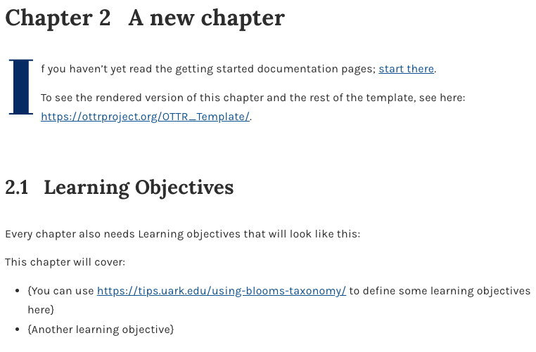
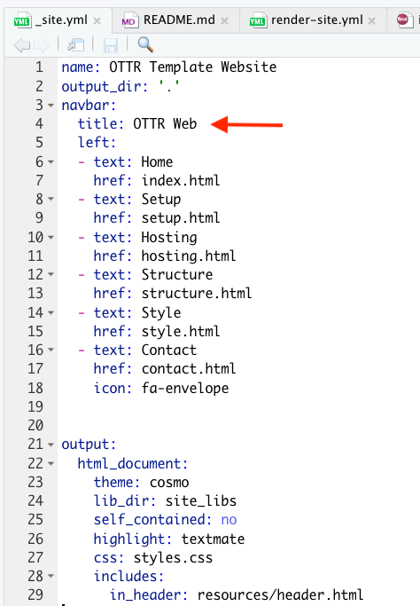
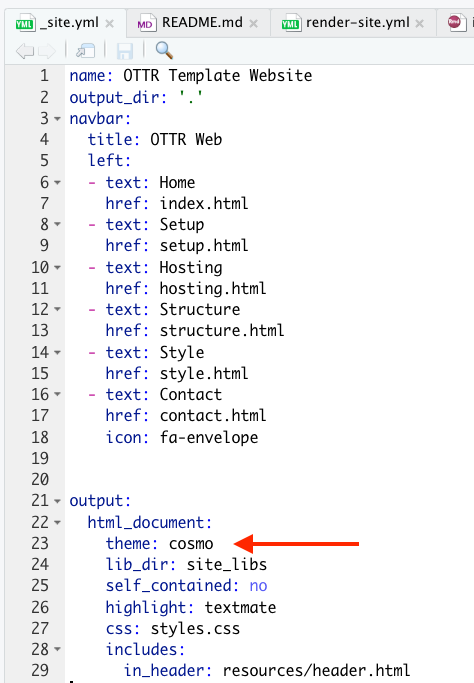

### Changing title

The title is specified on the `index.qmd`/`index.Rmd` page in the yml header. Modify the yaml header to change the title for your course.

```
---
title: "Title of Course"
---
```

Note that if one of the chapter `.qmd` or `.Rmd` files has a title in the yml that comes first alphabetically, it will be shown as the title of the course. Hence avoid having yml header titles for the chapter files.

## Customizing the Style

There are styles/brandings that are available in our library of style sets. These style sets are an alternative to customizing colors with `style_config_default.css` or `style_config_custom.css`. Changes to `style_config_default.css` will not influence a style set.

### Changing course text colors

:::: {.panel-tabset}

#### Course

##### **How Colors Are Controlled**

Two CSS files work together to separate OTTR defaults from your customizations:

<div style="display: grid; grid-template-columns: 1fr 1fr; gap: 2em;">

<div>

**`style_config_default.css`**

**Gets synced** from OTTR

- Defines all default CSS variables
- Ensures new variables exist before `style.css` references them
- Do not edit, changes will be overwritten on sync

</div>

<div>

**`style_config_custom.css`**

**Not synced**

- Overrides defaults
- Set your custom colors here
- Changes are safe from future syncs

</div>

</div>

##### **Customizing Your Colors**

Edit `style_config_custom.css` to override any default variable:

```css
:root {
  --link-color: #your-color-here;
  --heading-color: #your-color-here;
}
```

- Open `style_config_custom.css` in your repository
- Override only the variables you want to change
- Commit changes to a new branch and open a pull request

<p class="comment">
<em>You only need to set the variables you want to change. Anything not set in <code>style_config_custom.css</code> will fall back to the defaults in <code>style_config_default.css</code>.</em>
</p>

For example, within your `assets/style_config_custom.css` file, you would add:

```css
:root {
    --link-color: #a1005a;              /* deep magenta for links */
    --accent-color: #6e0040;            /* dark rose (headings, emphasis) */
    --highlight-color: #e754a6;         /* vibrant pink for UI highlights */
    --caption-color: #4a4a4a;           /* neutral dark gray */
    --background-color: #ffffff;
    --callout-background-color: #f6e9f1; /* soft pink-tinted gray */
}
```

<div style="display: grid; grid-template-columns: 1fr 1fr; gap: 2em;">

<div>

```{r, echo=FALSE, fig.cap="Default colors", fig.align='center'}

```

</div>

<div>

```{r, echo=FALSE, fig.cap="Changed colors", fig.align='center'}
knitr::include_graphics("resources/images/style_change.png")
```

</div>

</div>

##### **Recommended Resources**

1. Venngage Color Accessibility Tool: <https://venngage.com/tools/accessible-color-palette-generator>

2. ColorBuddy: <https://color-buddy.netlify.app/>

##### Receiving CSS Updates via Sync

If your repo is enrolled in OTTR sync, future CSS improvements will be updated automatically via your pull request.

- Confirm you have enrolled for [sync updates](ottr_sync.html)
- `style_config_default.css` will update on sync. **Do not customize this file**.
- Your customizations in `style_config_custom.css` will not be touched

#### Website

##### Navigation bar

To change the part of the navigation bar that says "OTTR Quarto", modify the title within the `_quarto.yml` file.

```{r, fig.align='center', fig.alt= "Change nav bar", echo = FALSE, out.width="40%"}

```

##### Overall theme

To change the color scheme/fonts of the website modify the `theme` in the `_quarto.yml` file (see [here](https://quarto.org/docs/output-formats/html-themes.html) for options):

```{r, fig.align='center', fig.alt= "Change theme", echo = FALSE, out.width="40%"}

```

##### Change the favicon

The small image that shows up on the browser can also be changed.

You can make a small image to replace the existing one by going to <https://favicon.io/favicon-converter/> and uploading an image that you would like.

Next, simply replace the image called `favicon.ico` in the `images` directory within the `resources` directory with the image you just created and downloaded from the favicon converter website.

##### Changing website colors

To customize colors for an OTTR website, change the variables in [`assets/style_config_default.css`](https://github.com/ottrproject/OTTR_Template_Website/blob/main/assets/style_config_default.css) in your website repository.

For example, you can update color variables such as:

```css
:root {
  --banner-color: #your-color-here;
  --button-color: #your-color-here;
}
```

- Open `assets/style_config_default.css` in your website repository
- Update the color variables you want to change
- Commit changes to a new branch and open a pull request


##### **Recommended Resources**

1. Venngage Color Accessibility Tool: <https://venngage.com/tools/accessible-color-palette-generator>

2. ColorBuddy: <https://color-buddy.netlify.app/>

##### Receiving CSS Updates via Sync

If your repo is enrolled in OTTR sync, future CSS improvements will be updated automatically via your pull request.

- Confirm you have enrolled for [sync updates](ottr_sync.html)
- `style_config_default.css` will update on sync. **Do not customize this file**.
- Your customizations in `style_config_custom.css` will not be touched

::::

### Using a style set

By default this course template will use the JHU Data Science Lab style. However, you can switch this to another style set by moving some files. Take a look at the `style-sets` for the other styles available.

:::{.callout-note}
Style sets are an alternative to using `style_config_default.css` to control colors and branding. If you use a style set, changes to `style_config_default.css` will not influence the style set.
:::
For example, if you are creating an ITCR course, you will need the files in `style-sets/itcr` or if you are making a DataTrail course, the files in `style-sets/data-trail`. For these instructions,let's refer to `data-trail` or `itcr` as the `<set-name>`.

1. On a new branch, copy the files for your template type. For R Markdown/Bookdown courses, copy `style-sets/<set-name>/index.Rmd` and `style-sets/<set-name>/_output.yml` to the top of the repository to overwrite the default `index.Rmd` and `_output.yml`. For Quarto courses, update `index.qmd`, `_quarto.yml`, and `styles.css` to match the style set you are using.
1. Copy over all the files in the `style-sets/<set-name>/copy-to-assets` to the `assets` folder in the top of the repository.
1. [Create a pull request](https://www.ottrproject.org/writing_content_courses.html#about-ottr-and-pull-requests) with these changes, and double check the rendered preview to make sure that the style is what you are looking for.

[Read here](https://bookdown.org/yihui/bookdown/output-formats.html) for more about how to customize your `_output.yml` file -- which is ultimately a part of how bookdown works.

<br>

## Creating your own style

Here are the instructions to change the aesthetic aspects about your course if you wish to create a new style for your course.

### Changing the favicon

Favicons are small icons that appear on your browser tab. To change the favicon, first take the image you would like to use to this [website](https://favicon.io/favicon-converter/) to convert it into a favicon. Then save this file in the `assets/` directory. On the `index.qmd` or `index.Rmd` file, make sure that the correct favicon is referenced to in the yaml header, so that the correct favicon will be used.

Here you can see that by default the Data Science Lab (dasl) favicon will be used.

```
---
title: "Course Name "
date: "`r format(Sys.time(), '%B, %Y')`"
site: bookdown::bookdown_site
documentclass: book
bibliography: [book.bib, packages.bib]
biblio-style: apalike
link-citations: yes
description: "Description about Course/Book."
favicon: assets/dasl_favicon.ico
---
```
If you are making an [ITN](https://www.itcrtraining.org/) course, then the favicon is already set up n the index-itcr.Rmd file. Just delete the existing `index.Rmd` file and rename the `index-itcr.Rmd` file to be `index.Rmd`. This is already part of the set up instructions.

### Adding logos

Logos for the table of contents are added with the  `_output.yml` file. This adds an image above the table of contents when the content is rendered with `bookdown`.

If you are creating a general DaSL course:
 - Please replace the URL in the line 13 of code for the `_output.yml` file with the URL for the GitHub repo for your course. This will allow people to more easily find how out how you created your course. Otherwise, they will be directed to this template.

If you are creating a DaSL course for a project other than [ITN](https://www.itcrtraining.org/):

 - Delete the `_output.yml` file and rename the `_output-itcr.yml` to be `_output.yml`.
 - Please modify the lines that link to the http://jhudatascience.org/ with your own website and logo if you are not part of the [jhuDaSL](http://jhudatascience.org/) .
- Please replace the URL in the line 13 of code with the URL for the GitHub repo for your course. This will allow people to more easily find how out how you created your course. Otherwise, they will be directed to this template.
- If you wish to create a different color scheme, the font colors can also be modified along with other aspects in the `assets/style.css` file. Take a look at the `assets/style_ITN.css` file to see what was changed for that color scheme from the `assets/style.css` file.
- You can replace the logo with the appropriate project logo by replacing `https://www.itcrtraining.org/` with the project website link and `resources/images/logo.png` for the project logo image path in line 11.


<br>

## Adding sections that aren't numbered
You may notice that currently the References page and about pages are not numbered like the other chapters. If you want additional sections like this, add a `.qmd` or `.Rmd` file and type the name of the page after a single hashtag `#` followed by this: `{-}`. This will exclude this page from being numbered.

Thus as example the reference page looks like this:

```
# References {-}
```

<br>

## Modifying the image at the top of the course

If you would like to change the image at the top of the Bookdown version of the course, you need to do the following steps:

- Add a new image file to the `assets` directory
- Modify the `assets/big-image.html` file on line 11. Change out `src = "assets/dasl_thin_main_image.png"` so that `dasl_thin_main_image.png` is replaced with the name of your image file.

---

← [Next Steps](next_steps.qmd) &emsp; [Customizing Checks](customize-robots.qmd) →
