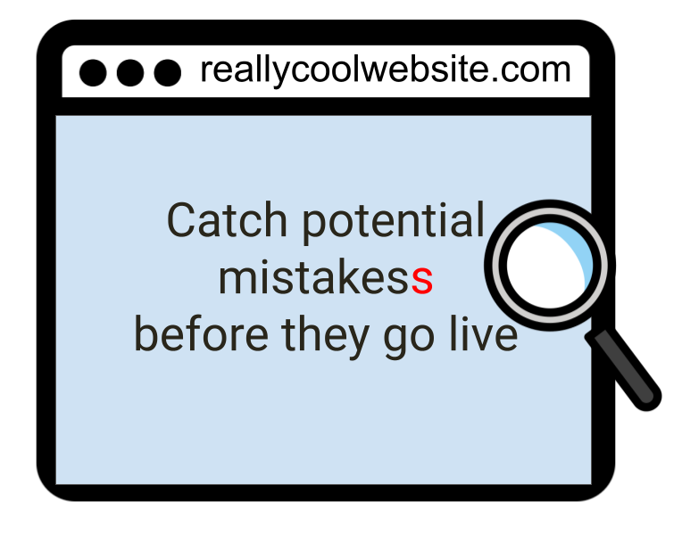

<style>
  #ottr-wizard {
    font-family: inherit;
    width: 100%;
    margin: 1.5rem auto;
    text-align: center;
  }
  #wizard-breadcrumb {
    font-size: 1rem;
    color: #666;
    margin-bottom: 1rem;
    min-height: 1.4rem;
    display: flex;
    flex-wrap: wrap;
    align-items: center;
    justify-content: center;
    gap: 4px;
  }
  .crumb-question { color: #888; }
  .crumb-answer   { color: #2780e3; font-weight: 600; }
  .crumb-sep      { color: #bbb; margin: 0 2px; }
  .wizard-question {
    font-size: 1.5rem;
    font-weight: 600;
    color: #222;
    margin-bottom: 1rem;
  }
  .wizard-options {
    display: flex;
    flex-wrap: wrap;
    gap: 10px;
    justify-content: center;
  }
  .wizard-btn {
    background-color: #ADD8E6;
    color: #222;
    border: none;
    border-radius: 6px;
    padding: 10px 20px;
    font-size: 18px;
    cursor: pointer;
    transition: background-color 0.15s ease;
  }
  .wizard-btn:hover { background-color: #85C1D4; }
  .result-card {
    border-radius: 8px;
    padding: 1.2rem 1.4rem;
    margin-top: 0.5rem;
  }
  .result-recommended {
    background-color: #e8f6fa;
    border-left: 4px solid #ADD8E6;
  }
  .result-standard {
    background-color: #f4f4f4;
    border-left: 4px solid #aaa;
  }
  .result-name {
    font-size: 1.1rem;
    font-weight: 700;
    color: #222;
    margin-bottom: 0.3rem;
  }
  .badge-recommended {
    background-color: #ADD8E6;
    color: #222;
    font-size: 0.75rem;
    font-weight: 600;
    padding: 2px 8px;
    border-radius: 20px;
    margin-left: 8px;
    vertical-align: middle;
  }
  .result-desc {
    font-size: 0.92rem;
    color: #444;
    margin: 0.5rem 0 1rem;
  }
  .result-link {
    display: inline-block;
    background-color: #ADD8E6;
    color: #222 !important;
    text-decoration: none;
    padding: 8px 18px;
    border-radius: 6px;
    font-size: 14px;
    font-weight: 600;
    transition: background-color 0.15s ease;
  }
  .result-link:hover { background-color: #85C1D4; }
  .restart-btn {
    background: none;
    border: none;
    color: #5aA8C0;
    font-size: 0.85rem;
    cursor: pointer;
    padding: 0;
    margin-left: 10px;
    text-decoration: underline;
  }
  .restart-btn:hover { color: #85C1D4; }
</style>


<div class = "banner_color">
  <br>
</div>


<p style="font-size: 16px;">OTTR (Open-source Tools for Training Resources ) is a set of tools and templates to help you make **websites, online courses, and dashboards** more easily (and for free)!</p>


<div id="ottr-wizard">
  <div id="wizard-breadcrumb"></div>
  <div id="wizard-content"></div>
</div>

<script>
(function () {
  const tree = {
    question: "What do you want to create?",
    options: [
      {
        label: "Website",
        next: {
          question: "Do you have existing R Markdown / Bookdown files?",
          options: [
            { label: "Yes", result: "rmarkdown_web" },
            { label: "No I'm starting fresh", result: "quarto_web" }
          ]
        }
      },
      {
        label: "Online Course",
        next: {
          question: "Do you have existing R Markdown files?",
          options: [
            { label: "Yes", result: "rmarkdown_courses" },
            { label: "No I'm starting fresh", result: "quarto_courses" }
          ]
        }
      },
      {
        label: "Metrics Dashboard",
        result: "dashboards"
      }
    ]
  };

  const results = {
    rmarkdown_web: {
      name: "R Markdown Websites",
      description: "An R Markdown / Bookdown-based website template. Best choice when you have existing .Rmd files to build on.",
      url: "getting_started.html#r-markdown-websites",
      recommended: false
    },
    quarto_web: {
      name: "Quarto Websites",
      description: "A Quarto-based website template. The modern standard, recommended for all new projects.",
      url: "getting_started.html#quarto-websites",
      recommended: true,
      fallback: "rmarkdown_web"
    },
    rmarkdown_courses: {
      name: "R Markdown Courses",
      description: "An R Markdown / Bookdown-based course template. Best choice when you have existing .Rmd files to build on.",
      url: "getting_started.html#r-markdown-courses",
      recommended: false
    },
    quarto_courses: {
      name: "Quarto Courses",
      description: "A Quarto-based course template. Recommended for new projects.",
      url: "getting_started.html#quarto-courses",
      recommended: true,
      fallback: "rmarkdown_courses"
    },
    dashboards: {
      name: "Dashboards",
      description: "Collect and display metrics from GitHub, Google Analytics, Google Forms, CRAN, Calendly, and more.",
      url: "getting_started.html#dashboards",
      recommended: false
    }
  };

  let history = [];
  let current = tree;

  function render() {
    const breadcrumb = document.getElementById("wizard-breadcrumb");
    const content    = document.getElementById("wizard-content");

    // Breadcrumb
    if (history.length > 0) {
      breadcrumb.innerHTML =
        history.map(h =>
          `<span class="crumb-question">${h.question}</span>` +
          `<span class="crumb-sep"> › </span>` +
          `<span class="crumb-answer">${h.label}</span>`
        ).join('<span class="crumb-sep"> &nbsp;·&nbsp; </span>') +
        `<button class="restart-btn" onclick="ottrRestart()">↺ Start over</button>`;
    } else {
      breadcrumb.innerHTML = "";
    }

    // Result
    if (current.result) {
      const r = results[current.result];
      const badge = r.recommended
        ? `<span class="badge-recommended">⭐ Recommended</span>`
        : "";
      const fallbackBtn = r.fallback
        ? `<div style="margin-top:1rem">
             <button class="restart-btn" onclick="ottrUseFallback('${r.fallback}')">
               I want to use R Markdown instead
             </button>
           </div>`
        : "";
      content.innerHTML = `
        <div class="result-card ${r.recommended ? "result-recommended" : "result-standard"}">
          <div class="result-name">${r.name}${badge}</div>
          <p class="result-desc">${r.description}</p>
          <a href="${r.url}" class="result-link">Get started with ${r.name} →</a>
          ${fallbackBtn}
        </div>`;

    // Question
    } else {
      const btns = current.options.map((opt, i) =>
        `<button class="wizard-btn" onclick="ottrChoose(${i})">${opt.label}</button>`
      ).join("");
      content.innerHTML = `
        <div class="wizard-question">${current.question}</div>
        <div class="wizard-options">${btns}</div>`;
    }
  }

  window.ottrChoose = function (i) {
    const opt = current.options[i];
    history.push({ question: current.question, label: opt.label });
    current = opt.result ? { result: opt.result } : opt.next;
    render();
  };

  window.ottrUseFallback = function (resultKey) {
    current = { result: resultKey };
    render();
  };

  window.ottrRestart = function () {
    history = [];
    current = tree;
    render();
  };

  render();
})();
</script>


### Quarto vs. R Markdown

OTTR templates come in two flavors based on which document format you use to write content: **R Markdown** (`.Rmd`) and **Quarto** (`.qmd`).

- **Quarto** is the next-generation successor to R Markdown, developed by Posit. It supports R, Python, Julia, and Observable JS, and offers a more consistent syntax and better cross-language support. It is the recommended choice for new projects.
- **R Markdown** is a widely used format that combines plain text, Markdown formatting, and R code chunks into a single document. It has a large ecosystem and is a solid choice if you already have `.Rmd` files or are following older OTTR tutorials.

If you're starting fresh and have no existing `.Rmd` files, go with a Quarto template. If you have existing `.Rmd` content or are working with a team already using R Markdown, the R Markdown templates are a fine choice.

---

<div style="position: relative; width: 100%; height: 0; padding-top: 77.2727%;
 padding-bottom: 0; box-shadow: 0 2px 8px 0 rgba(63,69,81,0.16); margin-top: 1.6em; margin-bottom: 0.9em; overflow: hidden;
 border-radius: 8px; will-change: transform;">
  <iframe loading="lazy" style="position: absolute; width: 100%; height: 100%; top: 0; left: 0; border: none; padding: 0;margin: 0;"
    src="https://www.canva.com/design/DAGwn4eF5mk/2RhR8mbSJxGL7XiaHSXPHg/view?embed" allowfullscreen="allowfullscreen" allow="fullscreen" alt = "OTTR Flavors and their uses">
  </iframe>
</div>
<a href="https:&#x2F;&#x2F;www.canva.com&#x2F;design&#x2F;DAGwn4eF5mk&#x2F;2RhR8mbSJxGL7XiaHSXPHg&#x2F;view?utm_content=DAGwn4eF5mk&amp;utm_campaign=designshare&amp;utm_medium=embeds&amp;utm_source=link" target="_blank" rel="noopener">OTTR at a Glance</a> by ITN

#### Benefits for all OTTR options:

- No software installations needed
- Automatically preview content on [GitHub](https://github.com/) before you publish
- Automatically check spelling (and customize your dictionary!)
- Automatically and periodically check for broken links
- Easily customize branding
- Easily include code (and avoid version difference issues using Docker containers)

```{r, fig.align='center', fig.alt= "OTTR helps build github based websites with less hassle. Catch potential mistakes before they go live", echo = FALSE, out.width= "40%"}

```

#### Benefits for specific uses:

- Websites can be created using [quarto](https://quarto.org/) or [bookdown](https://bookdown.org/)
- Courses can be easily formatted for learning platforms like [coursera](https://www.coursera.org/) and [Leanpub](https://leanpub.com/) (only edit once and it gets propagated to all locations - making for **easy updates**!)
- Metrics can be gathered from a variety of sources for dashboards


<br>
(*Note that you will need to establish a publishing contract with coursera if you want to publish there)


Check out this short video about OTTR:

<p align="center"><iframe width="560" height="315" src="https://www.youtube.com/embed/oQ8d42fSn0o" frameborder="0" allow="accelerometer; autoplay; clipboard-write; encrypted-media; gyroscope; picture-in-picture" allowfullscreen></iframe></p>

#### How to use OTTR:

1. Edit and write websites and courses in [R Markdown files](https://rmarkdown.rstudio.com/) or [Quarto](https://quarto.org/docs/output-formats/html-basics.html)
1. Use GitHub to host your content, we will walk you through how!
1. Let the GitHub actions in our tools do all the checks and rendering so you don't have too
1. Update your content as needed based on the errors OTTR finds and the preview
1. Publish your websites and courses!
<br>

#### How to Cite OTTR:

Please cite our [OTTR manuscript here!](https://www.tandfonline.com/doi/full/10.1080/26939169.2022.2118646)📝👀

<details>
  <summary>Click here for the BibTeX formatted citation</summary>
```
@article{ottr,
  author = {Candace Savonen, Carrie Wright, Ava M. Hoffman, John Muschelli, Katherine Cox, Frederick J. Tan and Jeffrey T. Leek},
  title = {Open-source Tools for Training Resources – OTTR},
  journal = {Journal of Statistics and Data Science Education},
  volume = {31},
  number = {1},
  pages = {57-65},
  year = {2023},
  publisher = {Taylor & Francis},
  doi = {10.1080/26939169.2022.2118646},
  URL = {https://doi.org/10.1080/26939169.2022.2118646},
  eprint = {https://doi.org/10.1080/26939169.2022.2118646}
}
```
</details>

<br>

<center>
<a href="getting_started.html">
  
</a>
</center>

<br>
