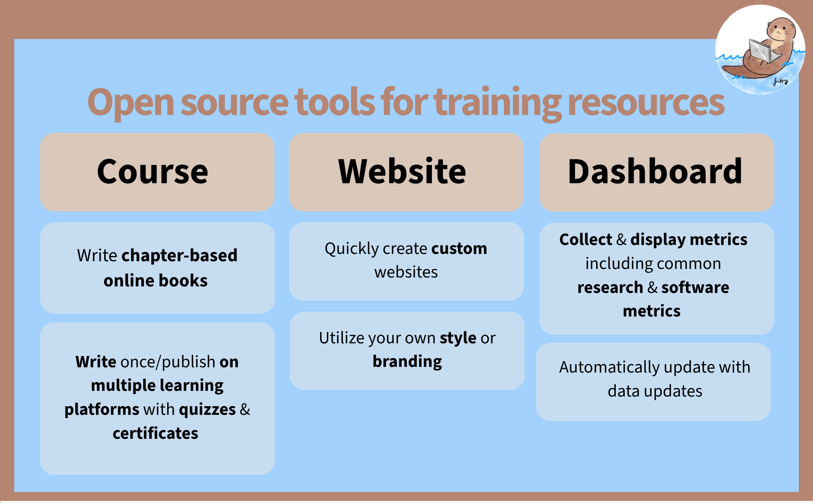

<style>
  .wizard-layout {
    display: grid;
    grid-template-columns: repeat(2, minmax(0, 1fr));
    gap: 1.75rem;
    align-items: start;
    margin: 1.5rem 0;
  }
  .wizard-main,
  .wizard-margin,
  .wizard-glance {
    min-width: 0;
    width: 100%;
  }
  #ottr-wizard {
    font-family: inherit;
    width: 100%;
    margin: 0 auto;
    text-align: center;
  }
  #wizard-breadcrumb {
    font-size: 1rem;
    color: #666;
    margin-bottom: 1rem;
    min-height: 1.4rem;
    display: flex;
    flex-wrap: wrap;
    align-items: center;
    justify-content: center;
    gap: 4px;
  }
  .crumb-question { color: #888; }
  .crumb-answer   { color: #2780e3; font-weight: 600; }
  .crumb-sep      { color: #bbb; margin: 0 2px; }
  .wizard-question {
    font-size: 1.5rem;
    font-weight: 600;
    color: #222;
    margin-bottom: 1rem;
  }
  .wizard-options {
    display: flex;
    flex-wrap: wrap;
    gap: 10px;
    justify-content: center;
  }
  .wizard-btn {
    background-color: #ADD8E6;
    color: #222;
    border: none;
    border-radius: 6px;
    padding: 10px 20px;
    font-size: 18px;
    cursor: pointer;
    transition: background-color 0.15s ease;
  }
  .wizard-btn:hover { background-color: #85C1D4; }
  .result-card {
    border-radius: 8px;
    padding: 1.2rem 1.4rem;
    margin-top: 0.5rem;
  }
  .result-recommended {
    background-color: #e8f6fa;
  }
  .result-standard {
    background-color: #f4f4f4;
  }
  .result-name {
    font-size: 1.1rem;
    font-weight: 700;
    color: #222;
    margin-bottom: 0.3rem;
  }
  .badge-recommended {
    background-color: #ADD8E6;
    color: #222;
    font-size: 0.75rem;
    font-weight: 600;
    padding: 2px 8px;
    border-radius: 20px;
    margin-left: 8px;
    vertical-align: middle;
  }
  .result-desc {
    font-size: 0.92rem;
    color: #444;
    margin: 0.5rem 0 1rem;
  }
  .result-link {
    display: inline-block;
    background-color: #ADD8E6;
    color: #222 !important;
    text-decoration: none;
    padding: 8px 18px;
    border-radius: 6px;
    font-size: 14px;
    font-weight: 600;
    transition: background-color 0.15s ease;
  }
  .result-link:hover { background-color: #85C1D4; }
  .restart-btn {
    background: none;
    border: none;
    color: #5aA8C0;
    font-size: 0.85rem;
    cursor: pointer;
    padding: 0;
    margin-left: 10px;
    text-decoration: underline;
  }
  .restart-btn:hover { color: #85C1D4; }
  .wizard-help-link {
    text-align: center;
    margin: 0.5rem 0 0;
  }
  .wizard-help-link a {
    display: inline-block;
    background-color: #f0fafd;
    color: #2a7a9a;
    border: 1.5px solid #ADD8E6;
    border-radius: 20px;
    padding: 7px 20px;
    font-size: 0.9rem;
    font-weight: 600;
    text-decoration: none;
  }
  .wizard-margin .callout {
    width: 100%;
    margin-top: 1rem;
    margin-bottom: 0;
    font-size: 0.92rem;
    line-height: 1.42;
  }
  .wizard-margin .callout-header {
    position: relative;
    justify-content: center;
  }
  .wizard-margin .callout-title-container {
    flex: 0 1 auto !important;
    text-align: center;
  }
  .wizard-margin .callout-icon-container {
    position: absolute;
    left: 1rem;
  }
  .wizard-margin .callout-btn-toggle {
    position: absolute;
    right: 1rem;
  }
  .wizard-margin .callout .callout {
    margin-top: 0.9rem;
  }
  .wizard-glance > p {
    margin: 0;
  }
  .wizard-glance img {
    display: block;
    width: 100%;
    height: auto;
  }
  .wizard-glance .glance-link {
    margin-top: 0.75rem;
    text-align: center;
  }
  .why-overview {
    margin: 1.5rem 0 2rem;
  }
  .why-overview .ottr-feature-section {
    grid-template-columns: 1fr;
    gap: 1rem;
    margin: 1rem 0 0;
  }
  .why-overview .benefit-grid {
    grid-template-columns: repeat(4, minmax(0, 1fr));
    gap: 1rem 1.25rem;
  }
  .why-overview .benefit-item {
    min-height: 0;
  }
  @media (max-width: 900px) {
    .wizard-layout {
      grid-template-columns: 1fr;
    }
    .why-overview .benefit-grid {
      grid-template-columns: repeat(2, minmax(0, 1fr));
    }
  }
  @media (max-width: 560px) {
    .why-overview .benefit-grid {
      grid-template-columns: 1fr;
    }
  }
</style>


<div class = "banner_color">
  <br>
</div>


::: {.wizard-layout}
::: {.wizard-main}
<div id="ottr-wizard">
  <div id="wizard-breadcrumb"></div>
  <div id="wizard-content"></div>
</div>

<div class="wizard-help-link">
  <a href="choose_template.html">
    Not sure? Help me choose →
  </a>
</div>

<p style="font-size: 16px;">OTTR (Open-source Tools for Training Resources) is a set of tools and templates to help you make **websites, online courses, and dashboards** more easily (and for free)!</p>

::: {.wizard-margin}
:::: {.callout-note collapse="true"}
## Quarto vs. R Markdown

OTTR templates come in two flavors based on which document format you use to write content: **R Markdown** (`.Rmd`) and **Quarto** (`.qmd`).

- **Quarto** is the next-generation successor to R Markdown, developed by Posit. It supports R, Python, Julia, and Observable JS, and offers a more consistent syntax and better cross-language support. It is the recommended choice for new projects and existing `.qmd` files.
- **R Markdown** is a widely used format that combines plain text, Markdown formatting, and R code chunks into a single document. It has a large ecosystem and is a solid choice if you already have `.Rmd` files or are following older OTTR tutorials.

If you're starting fresh or already have `.qmd` files, go with a Quarto template. If you have existing `.Rmd` content or are working with a team already using R Markdown, the R Markdown templates are a fine choice.

::: {.callout-warning}
## R Markdown is no longer being actively updated

Posit has shifted its focus to Quarto as the next-generation publishing system. R Markdown remains functional but **will not receive new features**. For any new project, start with a Quarto template.

**Resources for Quarto-fying your content:**

- [quartify](https://ddotta.github.io/quartify/articles/getting-started.html): an R package that automates conversion of R Markdown files to Quarto
- [Transitioning from R Markdown to Quarto](https://github.com/Openscapes/quarto-website-tutorial/blob/main/transition-from-rmarkdown.qmd): a practical guide from Openscapes
:::
::::
:::
:::

::: {.wizard-glance}


::: {.glance-link}
[Browse OTTR examples](examples.qmd)
:::
:::
:::

<script>
(function () {
  const tree = {
    question: "What do you want to create?",
    options: [
      {
        label: "Course",
        next: {
          question: "Do you already have course files to build on?",
          options: [
            { label: "Yes, Quarto (.qmd)", result: "quarto_courses" },
            { label: "Yes, R Markdown (.Rmd)", result: "rmarkdown_courses" },
            { label: "No, I'm starting fresh", result: "quarto_courses" }
          ]
        }
      },
      {
        label: "Website",
        next: {
          question: "Do you already have website files to build on?",
          options: [
            { label: "Yes, Quarto (.qmd)", result: "quarto_web" },
            { label: "Yes, R Markdown / Bookdown (.Rmd)", result: "rmarkdown_web" },
            { label: "No, I'm starting fresh", result: "quarto_web" }
          ]
        }
      },
      {
        label: "Metrics Dashboard",
        result: "dashboards"
      }
    ]
  };

  const results = {
    rmarkdown_web: {
      name: "R Markdown Websites",
      description: "An R Markdown / Bookdown-based website template. Use this when you have existing .Rmd files to build on.",
      url: "getting_started.html#r-markdown-websites",
      recommended: false
    },
    quarto_web: {
      name: "Quarto Websites",
      description: "A Quarto-based website template. The modern standard, recommended for new projects and existing .qmd files.",
      url: "getting_started.html#quarto-websites",
      recommended: true,
      fallback: "rmarkdown_web"
    },
    rmarkdown_courses: {
      name: "R Markdown Courses",
      description: "An R Markdown / Bookdown-based course template. Use this when you have existing .Rmd files to build on.",
      url: "getting_started.html#r-markdown-courses",
      recommended: false
    },
    quarto_courses: {
      name: "Quarto Courses",
      description: "A Quarto-based course template. Recommended for new projects and existing .qmd course files.",
      url: "getting_started.html#quarto-courses",
      recommended: true,
      fallback: "rmarkdown_courses"
    },
    dashboards: {
      name: "Dashboards",
      description: "Collect and display metrics from GitHub, Google Analytics, Google Forms, CRAN, Calendly, and more.",
      url: "getting_started.html#dashboards",
      recommended: false
    }
  };

  let history = [];
  let current = tree;

  function render() {
    const breadcrumb = document.getElementById("wizard-breadcrumb");
    const content    = document.getElementById("wizard-content");

    // Breadcrumb
    if (history.length > 0) {
      breadcrumb.innerHTML =
        history.map(h =>
          `<span class="crumb-question">${h.question}</span>` +
          `<span class="crumb-sep"> › </span>` +
          `<span class="crumb-answer">${h.label}</span>`
        ).join('<span class="crumb-sep"> &nbsp;·&nbsp; </span>') +
        `<button class="restart-btn" onclick="ottrRestart()">↺ Start over</button>`;
    } else {
      breadcrumb.innerHTML = "";
    }

    // Result
    if (current.result) {
      const r = results[current.result];
      const badge = r.recommended
        ? `<span class="badge-recommended">⭐ Recommended</span>`
        : "";
      const fallbackBtn = r.fallback
        ? `<div style="margin-top:1rem">
             <button class="restart-btn" onclick="ottrUseFallback('${r.fallback}')">
               I want to use R Markdown instead
             </button>
           </div>`
        : "";
      content.innerHTML = `
        <div class="result-card ${r.recommended ? "result-recommended" : "result-standard"}">
          <div class="result-name">${r.name}${badge}</div>
          <p class="result-desc">${r.description}</p>
          <a href="${r.url}" class="result-link">Get started with ${r.name} →</a>
          ${fallbackBtn}
        </div>`;

    // Question
    } else {
      const btns = current.options.map((opt, i) =>
        `<button class="wizard-btn" onclick="ottrChoose(${i})">${opt.label}</button>`
      ).join("");
      content.innerHTML = `
        <div class="wizard-question">${current.question}</div>
        <div class="wizard-options">${btns}</div>`;
    }
  }

  window.ottrChoose = function (i) {
    const opt = current.options[i];
    history.push({ question: current.question, label: opt.label });
    current = opt.result ? { result: opt.result } : opt.next;
    render();
  };

  window.ottrUseFallback = function (resultKey) {
    current = { result: resultKey };
    render();
  };

  window.ottrRestart = function () {
    history = [];
    current = tree;
    render();
  };

  render();
})();
</script>

---

::: {.why-overview}
### Why Use OTTR?

::: {.ottr-feature-section}
::: {.ottr-feature-copy}
#### Benefits for all OTTR options

::: {.benefit-grid}
::: {.benefit-item}
::: {.benefit-heading}
::: {.benefit-icon}

:::
**No software installation**
:::

Work in GitHub without installing a local publishing tool.
:::

::: {.benefit-item}
::: {.benefit-heading}
::: {.benefit-icon}

:::
**Preview before publishing**
:::

Automatically preview content on [GitHub](https://github.com/) before it goes live.
:::

::: {.benefit-item}
::: {.benefit-heading}
::: {.benefit-icon}

:::
**Built-in checks**
:::

Automatically check spelling, customize your dictionary, and periodically check for broken links.
:::

::: {.benefit-item}
::: {.benefit-heading}
::: {.benefit-icon}

:::
**Flexible publishing**
:::

Customize branding, include code, and avoid version differences with Docker containers.
:::
:::
:::
:::


### OTTR in Action

::: {.video-frame}
<iframe src="https://www.youtube.com/embed/oQ8d42fSn0o" title="Short video about OTTR" frameborder="0" allow="accelerometer; autoplay; clipboard-write; encrypted-media; gyroscope; picture-in-picture" allowfullscreen></iframe>
:::

### How to Cite OTTR

Please cite the [OTTR manuscript](https://www.tandfonline.com/doi/full/10.1080/26939169.2022.2118646).

<details class="template-choice citation-choice">
  <summary>
    <span>
      <strong>BibTeX formatted citation</strong><br>
    </span>
  </summary>

```bibtex
@article{ottr,
  author = {Candace Savonen, Carrie Wright, Ava M. Hoffman, John Muschelli, Katherine Cox, Frederick J. Tan and Jeffrey T. Leek},
  title = {Open-source Tools for Training Resources – OTTR},
  journal = {Journal of Statistics and Data Science Education},
  volume = {31},
  number = {1},
  pages = {57-65},
  year = {2023},
  publisher = {Taylor & Francis},
  doi = {10.1080/26939169.2022.2118646},
  URL = {https://doi.org/10.1080/26939169.2022.2118646},
  eprint = {https://doi.org/10.1080/26939169.2022.2118646}
}
```
</details>

<br>

<center>
<a href="getting_started.html">
  
</a>
</center>

<br>
