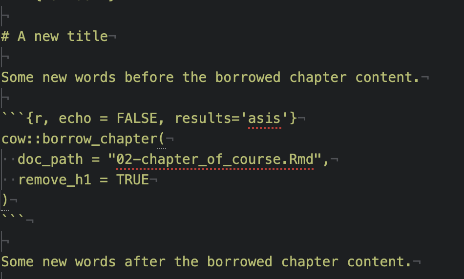

## Borrowing Chapters

If you have two courses where the content and topics overlap, you may want to share written material between the two.

However, sharing material by copying and pasting can lead to maintenance issues, as updating one would require remembering to update the other as well! 😱

In OTTR, we try to minimize maintenance pains. To get around this, we use `ottrpal::borrow_chapter()` from the [jhudsl/ottrpal](https://ottrproject.org/ottrpal/) package.
The `ottrpal` package is already on the `jhudsl/base_otter` Docker image  so you do not need to install it if you are using the Docker image or if you are have GitHub Actions do all the rendering for you.

:::{.callout-warning}
The `cow` package will soon be deprecated. Use `ottrpal::borrow_chapter()` instead of `cow::borrow_chapter()` in new and updated courses.
:::

:::{.callout-tip}
By default, borrow the source `.qmd` or `.Rmd` file rather than the rendered file from `docs/`, such as an `.html` or `.md` file.
:::

Then, wherever you would like the borrowed chapter to appear, put an R chunk with this; where `{r, echo = FALSE, results='asis'}` is included in your chunk arguments.

```
ottrpal::borrow_chapter(
  doc_path = "02-chapter_of_course.Rmd",
  repo_name = "ottrproject/OTTR_Template"
)
```

The magic of this function is that whenever the course is re-rendered it will knit the latest version of the chapter you are borrowing.
Note that this chunk cannot be run interactively, just include it in your Rmd and render your course as usual.

### Borrowing from a local file

If for some reason you would like a local file incorporated, just leave off the `repo_name` argument and `ottrpal::borrow_chapter()` will look for the chapter locally.

Have your chunk arguments include `{r, echo = FALSE, results='asis'}`.
```
ottrpal::borrow_chapter(
  doc_path = "02-chapter_of_course.Rmd"
)
```

### Borrowing from a private repository

Borrowing from a private repository is not supported and will not be supported.
Only borrow content from public repositories or from local files that are already available to the course.

### Removing an h1 header

If you want to change the title you can use an option `remove_h1` to remove the title from the incoming borrowed chapter.



### Linking between chapters

If you don't want the material from another chapter completely copied over, you might instead just want to put a link to the Bookdown chapter. You can just use the full URL. A link would look something like this:
```

```


You might want your course available for download as a docx. For example, you might be running a "train-the-trainer" workshop where trainees don't feel comfortable using Github to edit the lessons for their own use.

The following yml in `index.Rmd` allows you to render the docx with a table of contents:

```
output:
    bookdown::word_document2:
      toc: true
```

You can also incorporate a template docx if you have headers and logos you want to use. To incorporate a template, make sure you add the `reference_docx` argument:

```
output:
    bookdown::word_document2:
      reference_docx: <path/to/template>.docx
      toc: true
```

Learn more about templates [here](https://bookdown.org/yihui/rmarkdown-cookbook/word-template.html).


<br>

---

← [Next Steps](next_steps.qmd) &emsp; [Troubleshooting](faqs.qmd) →
