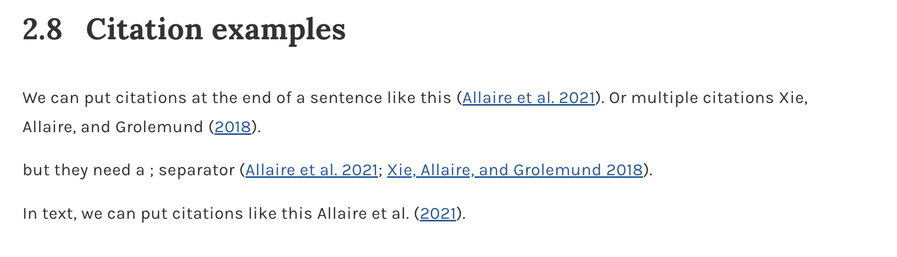
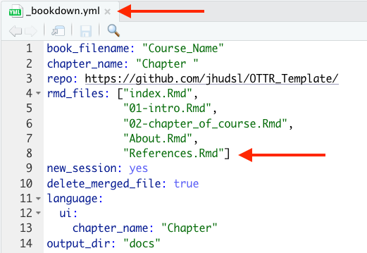
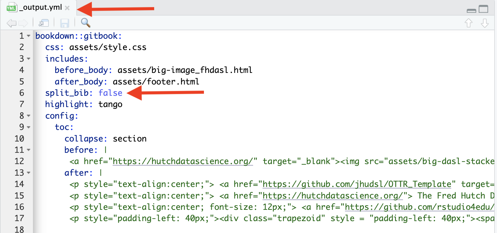

## Citing sources

You can generally follow the [Bookdown instructions about citations](https://bookdown.org/yihui/rmarkdown-cookbook/bibliography.html), but you **do not** need to add the additional bibliography argument at the top of the Rmd.

**Goal:** Add each source once to `book.bib`, cite it in your writing with a citation key, and let OTTR automatically build the reference lists.

:::{.callout-note}
This section explains how to include references and sources **that you cite in your course**, not how you want people to cite your OTTR course or website.
:::

### 1. Add the source to `book.bib`

To add a new reference source:

1. Open the `book.bib` file.
2. Add the new BibTeX entry.
3. Keep entries in **alphabetical order**.

:::{.callout-tip}
For articles, papers, and other sources with a DOI, use [doi2bib.org](https://www.doi2bib.org/) or [ZoteroBib](https://zbib.org/) to generate a **BibTeX-formatted reference** that you can copy into `book.bib`.
:::

You can also use reference managers like *Zotero* or *EndNote* to export a `.bib` file. From there, you can either combine that file with `book.bib` or manage your references separately.

**Other sources** can be added using this template:

```bibtex
@website{citekey,
    author = {First Last},
    title = {Title},
    url  = {www.website.com},
}
```

### 2. Cite the source in your writing

To reference citations in your writing, follow the [Bookdown citation syntax](https://bookdown.org/yihui/rmarkdown-cookbook/bibliography.html).

> Items can be cited directly within the documentation using the syntax `@key`, where `key` is the citation key in the first line of the entry, e.g., `@R-base`. To put citations in parentheses, use `[@key]`. To cite multiple entries, separate the keys by semicolons, e.g., `[@key-1; @key-2; @key-3]`. To suppress the mention of the author, add a minus sign before `@`, e.g., `[-@R-base]`.

| Citation style | Use this syntax |
|:---|:---|
| In-text citation | `@key` |
| Parenthetical citation | `[@key]` |
| Multiple citations | `[@key-1; @key-2; @key-3]` |
| Suppress author name | `[-@key]` |

:::{.callout-tip}
For multiple citations, separate citation keys with **semicolons**, not commas.
:::

For example:

```md
We can put citations at the end of a sentence like this [@rmarkdown2021].
Or multiple citations like this [@rmarkdown2021; @Xie2018].

In text, we can put citations like this @rmarkdown2021.
```

The rendered citations will look like this:



### 3. Keep the reference list in place

Citations will automatically create reference lists:

- at the bottom of each chapter included in your course
- at the end of your course

:::{.callout-important}
Keep the `References.Rmd` file, and keep it as the **last part** of the `_bookdown.yml` file, just as it appears in the template. This ensures that the full reference list appears in a place that makes sense.
:::



Alternatively, you can add a header for this list of references as the **last header** in any other Rmd file that is listed as the final file in `_bookdown.yml`.

:::{.callout-note}
If you would like to suppress references at the end of each chapter, add `split_bib: false` to your `_output.yml` file.
:::



---

**← Back to:** [Next Steps](next_steps.qmd) · **Also see:** [Giving Credits](more_features_credits.qmd) · [Customizing Style](customize-style.qmd)
