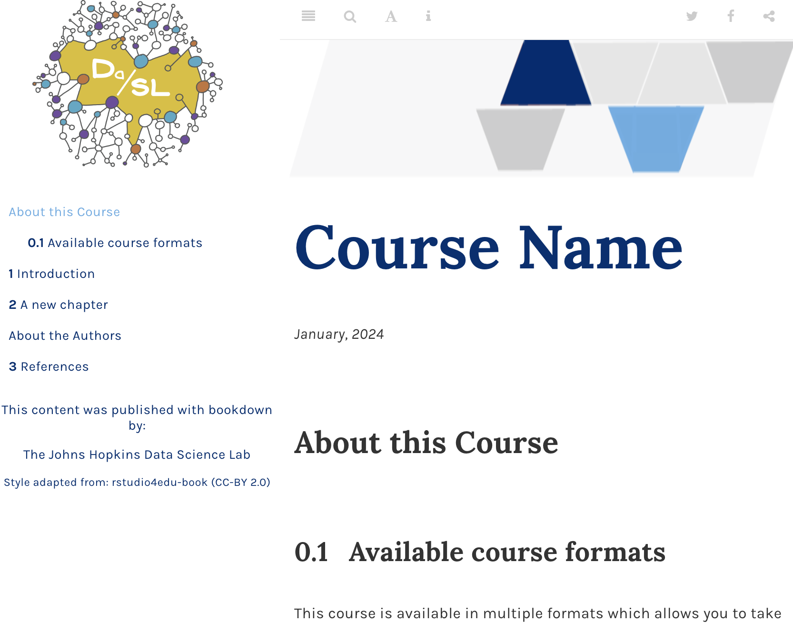
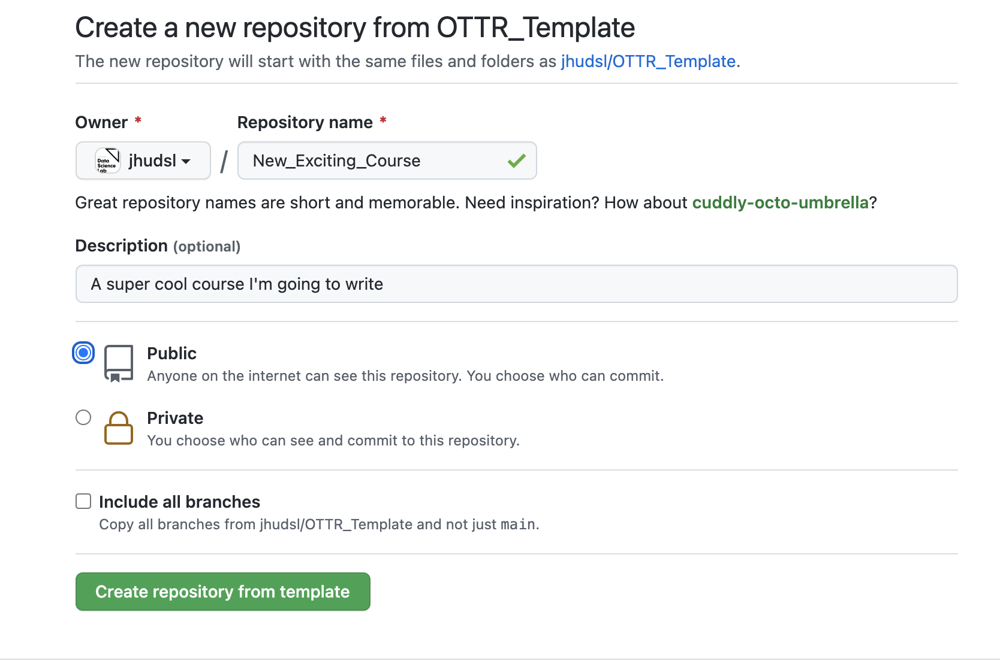
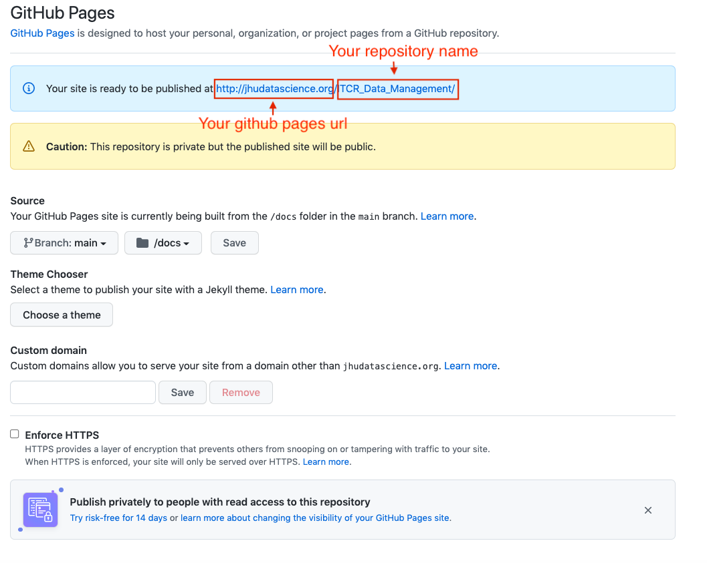
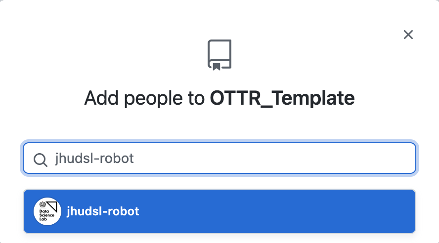
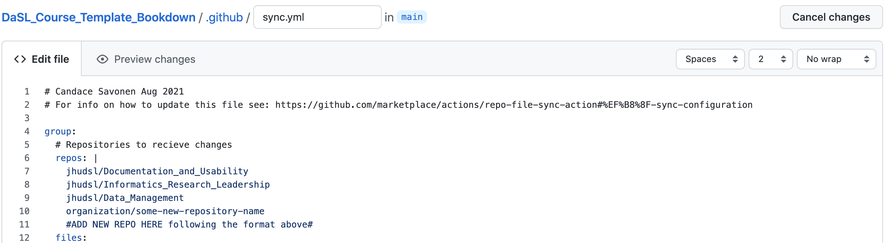

An R Markdown / Bookdown-based course template with a table of contents on the side. Supports publishing to Coursera and Leanpub. Best choice when you have existing `.Rmd` files to build on. If you are starting fresh or already have `.qmd` files, use the [Quarto course setup guide](quarto-course.qmd).

#### 1. Create a repository from the template

On the [landing page of the OTTR_Template repository](https://github.com/ottrproject/OTTR_Template), locate the green **Use this template** button in the upper right corner. Click it, then select **Create a new repository** and follow the instructions to configure your repository.

#### 2. Name your repository and fill in a short description

Enter a name in the **Repository name** field and provide a brief description in the **Description** box.

#### 3. Ensure your repository is set to `public`

Make sure to set it [to a public repository](https://docs.github.com/en/repositories/creating-and-managing-repositories/about-repositories#about-repository-visibility). The rendered pull request preview won't work on private repositories (though you can preview content locally).

#### 4. Click `Create repository from template` to proceed

After creating your repository, issues with setup instructions will be automatically filed. Navigate to the **Issues** tab and follow the instructions there.

#### 5. Check your GitHub Actions settings

Go to **Settings** > **Actions** > **General**. Make sure you have:

1. Given **Read and write permissions**
2. Checked **Allow GitHub Actions to create and approve pull requests**

Then click **Save**.

#### 6. Set up your GitHub personal access token

To give OTTR's robots the permissions they need, set a GitHub Secret called `GH_PAT`. Go to **Settings** > **Secrets and variables** > **Actions** and scroll down to **Repository secrets**. ([Read more about GitHub Secrets here](https://docs.github.com/en/actions/security-guides/encrypted-secrets).)

If you have organization admin privileges and plan to make multiple courses, you can set `GH_PAT` as an organization secret so you only need to do this once.

- Click **New repository secret** / **New organization secret**.
- Under **Name**, enter `GH_PAT` (this exact name is required).
- For **Secret**: create a [classic personal access token](https://docs.github.com/en/authentication/keeping-your-account-and-data-secure/managing-your-personal-access-tokens#creating-a-personal-access-token-classic) with `repo` and `workflow` scopes checked. Copy and paste it as the secret value.

If you encounter any problems, [report an issue here](https://github.com/ottrproject/OTTR_Template/issues/new?assignees=&labels=bug&projects=&template=course-problem-report.md&title%5B%5D=Problem).

#### 7. Set up GitHub Pages

In your repository, go to **Settings** > **Pages** and configure:

- **Source**: Deploy from a branch
- **Branch**: `main`, folder `/docs`

Click **Save**, then check **Enforce HTTPS** at the bottom of the page.

Your course URL will be `username.github.io/your-repo-name`, displayed under **Settings** > **Pages**. You can customize the base GitHub Pages URL (e.g., `jhudatascience.org`).

**Warning**: If you visit your URL before pushing any file changes, you may see a 404 error — nothing has been triggered to render yet. Check the URL after filing your first pull request.

#### 8. Enroll for updates (recommended)

The templates are always a work in progress. When updates are made to non-content files (checks, automation), pull requests are automatically filed to downstream repositories.

**To get sync updates, add `jhudsl-robot` as a collaborator** with write access: go to **Settings** > **Collaborators & Teams** > **Add people** and search for `jhudsl-robot`.

Then add your repository name to the [OTTR_Template sync file](https://github.com/ottrproject/OTTR_Template/blob/main/.github/sync.yml).

If you're **not** a member of the jhudsl GitHub organization, you can:

- Submit your repo info via the [OTTR Feedback Google Form](https://forms.gle/jGQnd5oemHWyuUq28)
- [Open an issue](https://github.com/ottrproject/OTTR_Template/issues/new?assignees=kweav&labels=&projects=&template=new-course-add-to-sync.md&title=) with your repo name and we'll add it
- Fork the repo, edit `sync.yml` by adding your repo name where it says `#NEW REPO HERE#`, and open a PR

| Repository | Issue Links |
|:---:|:---|
| OTTR_Template | [General issue](https://github.com/ottrproject/OTTR_Template/issues/new/choose) · [Add new repo to sync](https://github.com/ottrproject/OTTR_Template/issues/new?assignees=kweav&labels=&projects=&template=new-course-add-to-sync.md&title=) · [Update repo info in sync](https://github.com/ottrproject/OTTR_Template/issues/new?assignees=kweav&labels=&projects=&template=update-course-info-for-sync.md&title=) |
| OTTR_Quizzes | [Open an issue](https://github.com/ottrproject/OTTR_Quizzes/issues/new/choose) |

_If you have any questions about these updates or files, please tag `@kweav` or `@carriewright11`._

[Next Steps](next_steps.qmd) →
